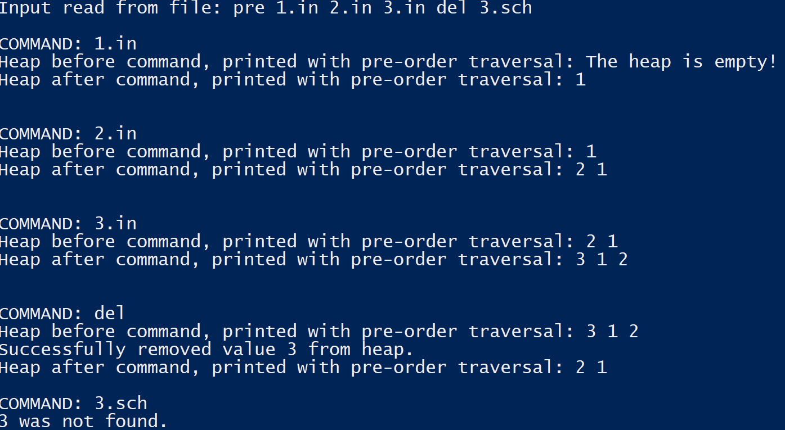

# MaxHeap
Java implementation of a max-heap.

#### Usage: 
1. Run `java MaxHeap` 
2. Enter the name of a file with commands when prompted. 

#### Commands:

All commands must be provided as a space-separated list in a text file. An example file, maxTest.txt, has been included in the repository.

* `pre, post, in`- The method in which the program will traverse the heap (pre, post, or in-order traversal) for displaying output. **Must be specified as the first command in the command file.**
* `'KEY'.in` - inserts specified 'KEY' (must be an integer) into the heap.
* `del` - Deletes the root of the heap and returns the value (always the largest value in the heap).
* `'KEY'.sch` - search for specified 'KEY' in the heap and return found or not found.

#### Output: 

At the start of program execution, the list of commands read in from the file is shown. Each command is then shown line by line, along with the max heap before the operation and the max heap after the operation.

